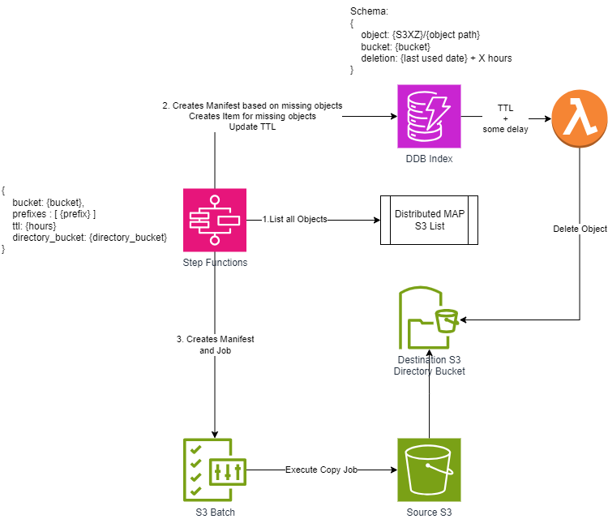
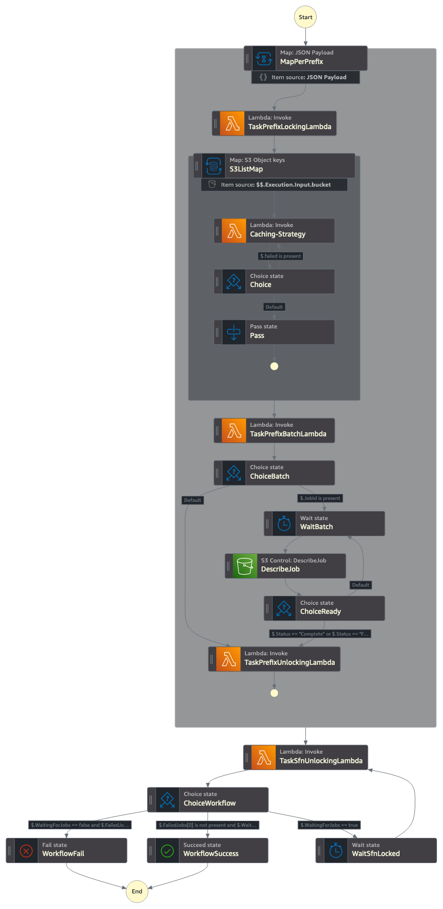

# S3 Express One Zone caching solution
## Introduction
This solution implements a strategy for copying data from traditional S3 buckets to directory buckets in S3 Express One Zone. It uses caching logic so that copying data is as fast and cost-effective as possible if the objects are already in the directory bucket. Automatic deletion and expiration based on the object's TTL is included.

[From the launch blogpost: ](https://aws.amazon.com/blogs/aws/new-amazon-s3-express-one-zone-high-performance-storage-class/)

> The new Amazon S3 Express One Zone storage class is designed to deliver up to 10x better performance than the S3 Standard storage class while handling hundreds of thousands of requests per second with consistent single-digit millisecond latency, making it a great fit for your most frequently accessed data and your most demanding applications. Objects are stored and replicated on purpose built hardware within a single AWS Availability Zone, allowing you to co-locate storage and compute (Amazon EC2, Amazon ECS, and Amazon EKS) resources to further reduce latency.

Customers looking to leverage the high throughput and low latency delivered by this new storage class, needed to design their own strategy for moving data, incurring in costs and time. This reference architecture aims to provide a starting point for some of the most common use cases, like FSI Research, Genomics workloads, Electronic Design Automation and Media distribution and rendering among other things.

The solution is able to process millions of objects at a time, just by specifying the source bucket for the information, the requested TTL, destination Directory Bucket and the Prefixes to be copied. More information in the [Usage section](#Usage).

## Architecture
A combination of S3 Batch Jobs, Lambda, Step Functions and DynamoDB facilitates data movement. Batch Jobs move the data, Step Functions determine what needs to be copied, and DynamoDB acts as the cache's source of truth.

**High level architecture:**




**Step Function visualization:**



## Usage
The solution is designed to be run two different ways:

* As part of a Job: This would be a blocking tasks at the beginning of a specific job. For example, when working with HPC for research, you might want to preload the data in S3 Express One Zone to be used during the job execution before the compute capacity is created. If you know which prefixes of data will be used, you can execute the Step Function with the parameters and wait for it to finish running (as a Blocking Task). After you get a successful execution, you can continue to provision the required compute capacity for data processing. This is much more cost effective than executing the copy jobs from within the HPC Worker Nodes, and delegates the responsibility of handling data movement to S3 Batch Jobs.

* As a scheduled task: This allows you to schedule data movement execution with Event Bridge or any other tool. Investment banks and hedge funds, for example, need to backtest their prior trading strategies. For example, you know that on Mondays data from the previous week will be analyzed. So you can pre-warm your cache with relevant data on Mondays at 5:00am to prepare for upcoming analysis jobs.

You can also use both strategies together. Based on the caching logic, the solution provided allows allows you to reuse existing data in the Directory Bucket instead of copying it again. This way you can preload the data you know for sure you'll need, and then compliment with a per-job request. Doing this will massively accelerates the Blocking Task executed in the first strategy, because some baseline data will already be available in the cache. But still all objects will be checked, and we will ensure that all the data needed is available at runtime by copying any missing objects.

To use the solution, you just need to execute the Step Function created by the CDK Deployment with the following format:

```
{
  "ttl": <TTL in Hours>,
  "bucket": "<Objects Source Bucket Name>",
  "prefixes": [ <List of S3 Prefixes to be Copied, eg. "prefix-01/"> ],
  "directory_bucket": "<Destination Directory Bucket Name>",
  "force_copy": < true / false >
}
```
The `force_copy` parameter allows you to ignore cache presence and for the batch job to run for all the objects in the prefixes. By default, you should always use this parameter as `false`, but there are certain circumstances like gray failures, S3 Batch Jobs failures or source content object update that would require you to recopy all the data ignoring the current state of the cache. In such situations, you can just change the flag to `true` to reprocess the whole prefix content.

The `prefixes` parameter is a list of prefixes residing in the `bucket` defined. You can choose to define the parameter in the following ways:
* Copy the whole bucket to the cache: `[ "" ]`
* Using Top Level Prefixes: `[ "year-2023/", "year-2024/" ]`
* Using deeper prefixes: `[ "year-2023/month-01/day-04", "year-2024/month-05/" ]`

By using deeper prefixes, you are parallelizing the job wider which will allow the step function to run faster. On the other hand, more prefixes will potentially mean more S3 Batch Job executions, charged at $0.25 per job. 
To cost optimize the solution we implemented an aggregation logic, to only run S3 Batch Jobs per prefix, when the prefix is bigger than 10k objects (default value). For prefixes smaller than that, a single job will be created aggregating the copy requirement. You can change this behavior by changing the Environment Variable `CONSOLIDATION_THRESHOLD` in the [`prefix_batch_lambda` definition](s3_caching_solution/s3_caching_solution_stack.py)

Source and Destination buckets needs to reside in the same AWS Region and same AWS Account along with the deployment of this solution.

**Note:** DynamoDB Time to Live (TTL) functionality is used for object deletion from Directory Buckets upon expiration. DynamoDB TTL functionality operates on best-effort basis, therefore it can take time to delete entires from the DynamoDB caching database. This can affect the deletion time of cached objects DynamoDB supervises in S3 Express One Zone.

If your source data is encrypted using KMS, you need to enable the corresponding permissions on the KMS Key and IAM Role (S3CachingSolutionStack-BatchRole###).

## Performance Tuning
Current configuration is design to accommodate most scenarios, but depending on your usage pattern (e.g. number of objects per prefix, number of prefixes, etc) you might need to fine tune it to your needs. All of this configurations should be applied to the [CDK Stack here](s3_caching_solution/s3_caching_solution_stack.py). 
Some of the most common parameters are:
* Lambda Memory allocation: we recommend using [AWS Compute Optimizer](https://aws.amazon.com/compute-optimizer/) for this. After running the Step Function a few times, you'll get a sizing recommendation based on your usage pattern. Because the variability of number of object per request, we recommend to have a buffer overhead for the Batch Lambda functions (PrefixBatchLambda and ConsolidationBatchLambda)
* Step Functions Distributed MAP State concurrency: this is the total number of lambda functions you allow the solution to run per Branch. Default is 40, but depending on the number of prefixes you usually copy, you might want to adjust this number to process objects quicker or avoid hitting the maximum number of Lambda Concurrent Executions per account.
* Batch Sizes: The bigger the batch, the longer the lambda takes to run. This allows you to control in conjunction with the Concurrency, how fast you'll be updating DynamoDB Items. We don't suggest to reduce this number by much, because of how the solution handles intermediate objects in S3 and limitations on the state transition input size.

## Monitoring
The Step Function will return the final result for the job as Successful or Failed, in which case it will individually report any S3 Batch Job partially or totally failed with information pointing you to the report.

Additionally, we are creating two CloudWatch Dashboard and some alarms based on Lambda logging, ready to monitor metrics and errors for the whole solution. You can find the Dashboard in CloudWatch, and you'll need to subscribe to the SNS Topic created for the alarms (S3CachingSolutionStack-NotificationTopic###).

## Solution Costs
The solution is fully serverless, meaning that you only pay for what you use. I'll present a few costs scenarios to consider:

#### Scenario 1 - Copying millions of small <512k objects :
You are executing the step function to move 1TB of data for a total of 3M object with an avg. object size of 0.35MB. The objects will be distributed among 20 prefixes and cache will be retained for 24 hours:

| Pricing Category | Cost (N. Virginia) | Total |
| :---------------- | :------: | ----: |
| S3 Batch Job - Tasks | 0.25 |  $5.00 |
| S3 Batch Job - Objects | 0.000001 |  $3.00 |
| S3 List API - Standard | 0.000005 |  $15.00 |
| S3 Get API - Standard | 0.0000004 |  $1.20 |
| S3xz Put API | 0.0000025 |  $7.50 |
| S3xz Data Put (+512kb) | 0.008 |  $0 |
| DynamoDB write | 0.00000125 |  $3.75 |
| Lambda execution | 0.0000002 |  $0 |
| Lambda memory (Gb-Second) | 0.0000133334 |  $2.67 |
| Step Function | 0.000025 |  $0.02|
| | | $38.13 |

| Additional Costs | Cost (Virginia) | Total |
| :---------------- | :------: | ----: |
| S3xz Data Storage | 0.16 | $5.39 |

#### Scenario 2 - Copying 100s of thousands of medium size objects:
You are executing the step function to move 3TB of data for a total of 330k object with an avg. object size of 9.53MB. The objects will be distributed among 10 prefixes and cache will be retained for 12 hours:

| Pricing Category | Cost (N. Virginia) | Total |
| :---------------- | :------: | ----: |
| S3 Batch Job - Tasks | 0.25 |  $2.50 |
| S3 Batch Job - Objects | 0.000001 |  $0.33 |
| S3 List API - Standard | 0.000005 |  $1.65 |
| S3 Get API - Standard | 0.0000004 |  $0.13 |
| S3xz Put API | 0.0000025 |  $0.83 |
| S3xz Data Put (+512kb) | 0.008 |  $23.29 |
| DynamoDB write | 0.00000125 |  $0.41 |
| Lambda execution | 0.0000002 |  $0.00 |
| Lambda memory (Gb-Second) | 0.0000133334 |  $0.29 |
| Step Function | 0.000025 |  $0.01 |
| | | $29.44 |

| Additional Costs | Cost (Virginia) | Total |
| :---------------- | :------: | ----: |
| S3xz Data Storage | 0.16 | $8.08 |

#### Scenario 3 - Leveraging the cache logic based on Scenario 2:
You are executing the step function again for a new job, but on this one there is an overlap of requirements with Scenario 2 and the TLL is still not expired.
The request includes to move the current 3TB of data for a total of 330k object with an avg. object size of 9.53MB. The objects will be distributed among 10 prefixes and cache will be retained for 12 hours (full overlap with Scenario 2). 
Additionally to that in the same request, you add 5 more prefixes with a TTL of 12 hours, 512GB of Storage for an added 100k objects with an avg. object size of 5.24MB.
In total, this new request will cost:

| Pricing Category | Cost (N. Virginia) | Total |
| :---------------- | :------: | ----: |
| S3 Batch Job - Tasks | 0.25 |  $1.25 |
| S3 Batch Job - Objects | 0.000001 |  $0.10 |
| S3 List API - Standard | 0.000005 |  $2.15 |
| S3 Get API - Standard | 0.0000004 |  $0.04 |
| S3xz Put API | 0.0000025 |  $0.25 |
| S3xz Data Put (+512kb) | 0.008 |  $3.71 |
| DynamoDB write | 0.00000125 |  $0.54 |
| Lambda execution | 0.0000002 |  $0.00 |
| Lambda memory (Gb-Second) | 0.0000133334 |  $0.30 |
| Step Function | 0.000025 |  $0.01 |
| | | $8.35 |

| Additional Costs | Cost (Virginia) | Total |
| :---------------- | :------: | ----: |
| S3xz Data Storage | 0.16 | $9.43 |

## Pre requirements

This project is built using Python3 and CDK, before you start, make sure to have all the pre requirements properly installed in your environment.

* AWS CLI https://aws.amazon.com/cli/ 
* AWS CDK 2.135.0+ https://docs.aws.amazon.com/cdk/latest/guide/getting_started.html#getting_started_install
* Python 3.9+

## Deployment
Deploying the solution is easy, you just need to

To manually create a virtualenv on MacOS and Linux:

```
$ python3 -m venv .venv
```

After the init process completes and the virtualenv is created, you can use the following command to activate your virtualenv

```
$ source .venv/bin/activate
```

Windows users can activate the virtualenv with this command:

```
% .venv\Scripts\activate.bat
```

Once the virtualenv is activated, you can install the required dependencies.

```
$ pip install -r requirements.txt
```

At this point you can now synthesize the CloudFormation template for this code and deploy it.

```
$ cdk synth
$ cdk deploy
```

## Useful commands

 * `cdk ls`          list all stacks in the app
 * `cdk synth`       emits the synthesized CloudFormation template
 * `cdk deploy`      deploy this stack to your default AWS account/region
 * `cdk diff`        compare deployed stack with current state
 * `cdk docs`        open CDK documentation

## Security
See [CONTRIBUTING](CONTRIBUTING.md) for more information.

## License
This library is licensed under the MIT-0 License. See the [LICENSE](LICENSE) file.